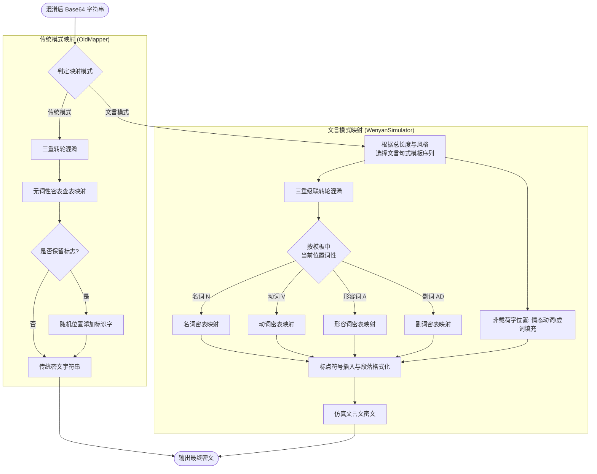

# 字符映射管线

字符映射管线是魔曰（Abracadabra）将混淆后的数据符号化为可读中文字符的核心步骤，其包含三个主要部分：

- **分类映射表**：根据词法与语法功能（如名词、动词、形容词、副词）将 Base64 字符映射到相应的古文汉字。
- **虚词表**：提供各种文言虚词与情态助词的库，用于修饰句式结构。
- **句式模板库**：编排了一百余种文言句式，为拼接生成看似连贯的古文提供结构语法。

魔曰的字库不同于其他同类工具，它抛弃了大量让人眼花缭乱的冷门生僻字，而是从《通用规范汉字表》的一、二级字中人工挑选出几百个常用的高频汉字，并适当混合了少量的日本和制汉字（仅传统加密存在日本和制汉字），保证了密文的日常观感。

完整的字库与模板定义公开可查，可参考 [**映射表(传统)**](https://github.com/SheepChef/Abracadabra/blob/main/src/javascript/mapping.json) 或 [**映射表(仿真)**](https://github.com/SheepChef/Abracadabra/blob/main/src/javascript/mapping_next.json)。

## 传统映射模式

::: tip 传统模式示例
困句夏之全玚凪斋或骏琅咨兆咩谜理金说宙银歌舒
:::

传统模式是魔曰为了兼容老版本或追求极致压缩比而保留的经典模式：

- 它的映射表由几百个无词性分类的常见汉字组成。
- 密文表现为一长串无规律、无标点的汉字序列。
- 会在密文的随机位置插入特定的标识字（如 `SIG_DECRYPT_CN` / `SIG_DECRYPT_JP`）来支持自动识别解密。也可以通过“去除标志”来去除标识字，但此时解密需要手动勾选“强制解密”。

::: warning 已终止支持

传统加密已终止支持，相关代码不会被移除，但也不会接受进一步更新。

传统加密模式下，不可启用高级加密功能。

:::

## 文言映射模式

文言文仿真模式是魔曰的标配映射模式。它不再是将字符简单地堆叠，而是：

- **词性划分**：将密本汉字严格划分为名词（N）、动词（V）、形容词（A）、副词（AD）。
- **转轮级联混淆**：每个输入的 Base64 字符，都会首先运行三重转轮级联混淆计算。
- **查表映射**：根据当前句式模板中该位置要求的词性，在对应的子词表（名词表、动词表等）中检索字符映射。
- **助词填充**：在非载荷字的位置，随机抽取语气词（如“也”、“乎”）、连词（如“而”、“以”）和情态动词进行组句填充，从而拼接出文法自然的仿真密文。

## 映射流程图

