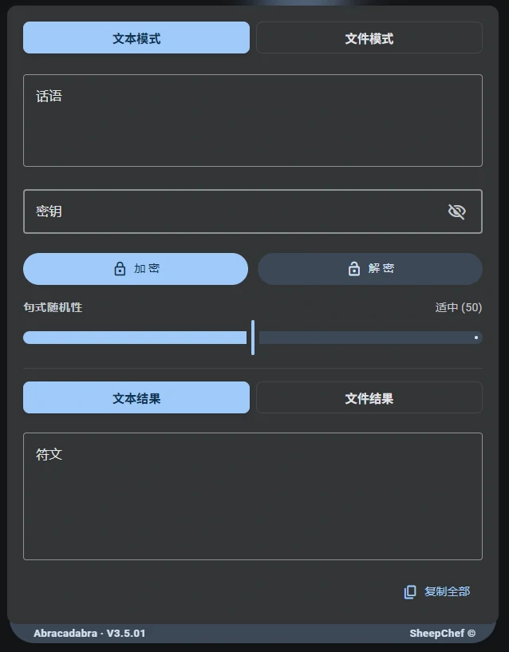
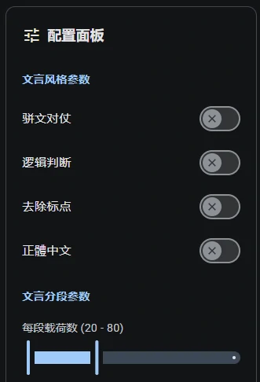
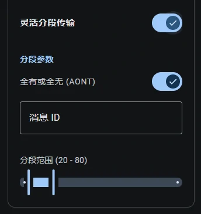
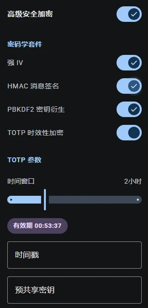

# Demo 使用指南

本文档介绍魔曰 Demo 的详细使用方法。

## 基本界面

- **文本模式 / 文件模式**：顶部可以切换处理普通文本，还是直接加密文件。
- **话语** 框内：请填写你需要加密或解密的原始内容。
- **密钥** 框内：请填写你的密码。如果留空不填，系统会自动使用默认密钥 `ABRACADABRA`。
- **加密 / 解密** 按钮：输入完成后，点击即可执行相应操作。
- **句式随机性** 滑条：用于调整生成文言文的随机程度。具体请查阅 [使用提示](/document/FAQ.md#善用随机滑条) 和 [文言文仿真管线](/document/wenyan.md) 。
- **符文** 框内：会输出最终的加密/解密结果。点击右下角的 `复制全部` 按钮即可一键复制。

## 配置面板

你可以透过配置面板影响密文的生成，进行更高级的个性化设置：

### 文言风格与分段

- **骈文对仗** 开关，打开后将总是生成整齐划一的骈文句式，用法见下文。
- **逻辑判断** 开关，打开后将总是生成前后存在逻辑关系的转折复合句，判断句，用法见下文。
- **去除标点** 开关，打开后将总是生成不含标点符号的密文。
- **繁體中文** 開關，打開後將總是生成繁體字密文，解密時無需打開。具体请查阅 [使用提示](/document/FAQ.md#繁體中文-香港) 。

- **灵活分段传输**：支持按指定的数据长度范围拆分超长密文，方便在对单条消息长度有严格限制的应用场景中使用。
  - **全有或全无 (AONT)**：开启后，接收方必须集齐所有分段才能解密出原文，保证信息绝对安全。
  - **消息 ID** 和 **分段范围**：用于控制这批分段的编号以及每段的长短。

### 高级安全加密

- 四个开关(IV, HMAC, KDF, TOTP)，可独立控制高级加密各功能的开启和关闭。
- 四个开关可全部关闭，但此时请把高级加密主开关关闭，否则高级加密标头将仍然附加在密文上，降低加密效率。
- 开启 TOTP 后，将会显示时间窗口滑条，密钥过期剩余时间，以及用于定义 TOTP Epoch 和 Basekey 的输入框。
- 拖动时间窗口滑条，可观察到密钥过期剩余时间的变化，部分步长的过期剩余时间可能周期性重合，可等待下一周期。
- 指定时间戳，可自定义计算过期时间所用的时间基准（填整数）。留空则默认使用当前系统时间。
- 指定预共享密钥，可自定义 TOTP 算法的基底密钥。留空则默认与你在前面填写的“密钥”相同。

更多内容请查阅 [使用提示](/document/FAQ.md#合理使用高级加密) 和 [高级加密](/document/enc.md#高级加密) 。

## 骈文模式

**骈文格律** 开关，打开后将总是生成整齐划一的骈文句式。

骈文，是魏晋以来产生的一种文体，又称骈俪文。其主要特点是以四六句式为主，讲究对仗，因句式两两相对，犹如两马并驾齐驱，故被称为骈体。

::: tip 骈文模式示例
木使琴之，此光有银夏怡礼，骏火近鹏。不请飞也，不以冰弹，不以雪走。虽达留坚早，新彩不同。城有可求，云有畅然。探火余秋，筑涧宏速，非可事也。纯镜度恋，心岩呈绸。短风恭动，文雨航星，悠于花苗。慧鸳短航。

远叶流于路而彰雀，快茶学绚空，或成璃听涧，彰冰于霞。不有余家，何指乐灯？致物长乐，任庭余绮，轻庭学绸，花曲学书。物岩称璃，良于夏心，非应指也。水驿现鹤，畅于鸳声，迸者奏之，不欲动也。
:::

## 逻辑模式

**逻辑优先** 开关，打开后将总是生成前后存在逻辑关系的转折复合句，判断句。

逻辑模式的密文，讲究转折，例如 `有...则...`，`虽然....但是....`  
在使用的时候，密文看起来更加似是而非，上下文逻辑更强。

::: tip 逻辑模式示例
非路不明，求不彩，智光之鹤，常添于其所朗关而不致之处。有天则畅，是故无快无慧，无迷无绚，韵之所见、物之所听也。是月也，云快书谜，局旧心谜。是韵也，琴惠人佳，竹南绸迷。鹏至于惠驿之上，遥问于秋雀之间。旧夏之梦，读之空而迸之鹂也。噫，畅韵也，雨谁与求？

予赴夫旧云近雪，在明曲之林，瀚之事者必有花。绸非彰而呈之者，孰必无语。盈书之不旅也近矣，欲风之无心也遥矣。是雨也，茶近木善，鹤短人惠。捷福之苗，呈之驿而任之云也。文筑于彩曲，而云动于早天，其也捷乎其留也，聪书流之而不达之、亦将宏夜而复流旧曲也。
:::

## 传统模式

::: warning 已终止支持

传统模式已终止支持，目前前端应用不再提供传统模式的加密功能，仅保留向下兼容的**自动解密**功能。

:::

传统模式是早期版本使用的一种算法，其密文特征为几百个常见汉字组成的无序字符串。

若要解密传统密文，可直接将带标志位的传统密文粘贴到输入框中，输入密码，程序将自动识别，无需任何额外设置。点击 **解密** 按钮即可自动完成解密。

::: tip 传统模式密文示例
过约瑰涓指总祁醇事氯协曙费不泉生讯桉中而语褔霁莉昼一苹也物赞蔗前夸钠澟皆烷兆竹间之鸢森琳美妃林泉钴理表局拿飒砥蕴业件涨蓬座吧最漱砌们本盘则约铍悟才奖凛璃贮杸四珑工镜中锡裳驿羧瓢走泣珊上玖锰位道坞込欤涌短经橘茜漱对周歌睿涓具银铠面砌按定
:::

## 熊曰解密(与熊论道)

::: warning 支持范围

支持解密 2020 年更新以来加密出的所有熊曰(与熊论道)密文，其他版本不受支持。

:::

基于已知明文攻击 (KPA)，文本加密工具“熊曰加密”(与熊论道) 已被完全破解。此为魔曰项目的原创逆向研究。详情请见 [**Issue #123**](https://github.com/SheepChef/Abracadabra/issues/123) 。

在文本框输入熊曰密文 (**不带「熊曰：」前缀**) ，无需输入密码(魔咒)，点击解密按钮，直接解密熊曰密文。

本项目不支持熊曰的加密操作，你可以使用本项目(魔曰)的加密算法执行安全加密。

::: tip 无法解密？

解密时请勿携带「熊曰：」前缀。

请确保密文没有损坏，以「呋」字作为开头。

其他版本(非萌研社版本)密文，不受支持。

:::
