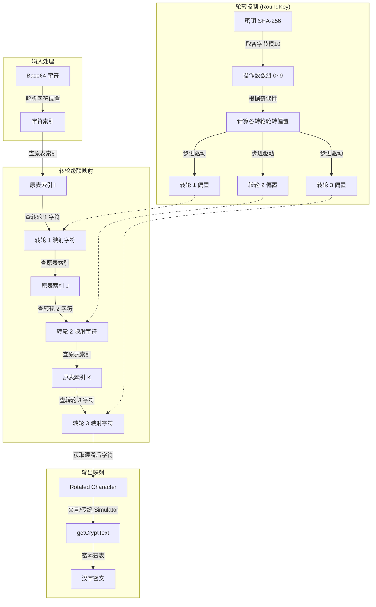
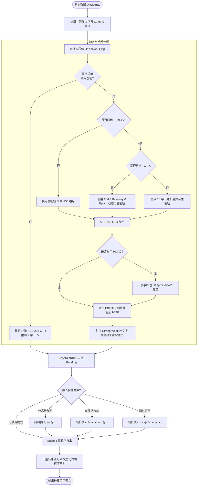

# 加密和混淆管线

魔曰采用密码学主流的 AES-256-CTR 作为核心加密算法，为密文的机密性提供强有力的安全保障。

## AES-256 核心加密

在默认加密模式下，魔曰的密钥与初始化向量(IV)派生如下：
- **密钥生成**：对用户输入的密钥(魔咒)进行一次 SHA-256 哈希，其值作为 AES-256 的加密密钥。
- **IV 生成**：在第一次哈希的结果后附加两个安全随机字节，再次进行 SHA-256 哈希，取结果的前 16 字节作为 CTR 模式的初始化向量(IV)。为了解密时能重构 IV，这两个附加 of 随机字节会随密文一起保存。

## 高级加密套件

魔曰支持数个高级加密组件，允许资深用户根据需要增强密文在特殊场景下的安全性。

启用高级加密套件通常会因为附加签名、盐值或强 IV 而使密文长度增加。除 AES-256-CTR 外，下列密码套件受支持，且均可独立开启和关闭：

- **StrongIV**
- **HMAC-SHA256**
- **PBKDF2**
- **TOTP**

### StrongIV

为了尽可能节省密文长度，魔曰默认使用熵为 16 bits(2 字节)的弱初始化向量来派生 AES 的 IV。

开启 StrongIV 后，魔曰将使用密码学安全的随机数生成器产生完整的 128 bits(16 字节)初始化向量。
- **作用**：大幅降低多次使用相同密钥加密相同明文时出现密钥流重用的概率，抵抗重放与已知明文攻击。
- **副作用**：会将密文增长 14 字节，导致最终的文言文密文变长。

### HMAC-SHA256

魔曰默认不对消息进行强完整性验证，仅使用轻量级的[**卢恩算法**](https://zh.wikipedia.org/zh-cn/%E5%8D%A2%E6%81%A9%E7%AE%97%E6%B3%95)(US2950048，ISO/IEC 7812-1)来对解密后的结果做快速校验（检错率约 70%）。

打开 HMAC 后，魔曰将使用加密密钥对密文执行 HMAC-SHA256 签名，并将 32 字节的签名附加在密文之后。
- **作用**：提供强完整性校验，防止密文在传输过程中被篡改，抵抗选择密文攻击。
- **副作用**：会将密文增长 32 字节。

### PBKDF2

::: tip 提示

启用 PBKDF2 后，由于需要执行十万次密钥哈希迭代，在部分低算力设备上可能会导致短暂的计算卡顿。

:::

默认情况下，魔曰直接将密钥的一次 SHA-256 哈希作为加密密钥。

打开 PBKDF2 后，魔曰会生成一个 16 字节的随机盐值，并使用 PBKDF2 算法对密钥执行 100,000 次哈希迭代(使用 SHA-256 摘要算法)以派生最终的加密密钥，该盐值会被附加在密文之后。
- **作用**：显著增加密钥派生难度，能有效抵抗针对弱密钥的离线彩虹表攻击与暴力破解。
- **副作用**：密文增长 16 字节。

### TOTP

::: tip 提示

TOTP 并非独立的加密算法，它需要配合 PBKDF2 才能生效。

:::

TOTP 是 PBKDF2 的附加扩展，允许用户向密文引入**时效性**：
- 它使用修改后的 TOTP 算法，生成一个 16 位的动态数字(而非传统的 6 或 8 位)。该数字并不直接用于 AES 加密，而是作为 PBKDF2 派生密钥时的“动态盐值”。
- 允许用户自定义 TOTP 步长窗口(对应时间范围为 3 分钟到 1 年)、预共享密钥(BaseKey，默认为主密钥)以及特定的基准时间戳。
- **作用**：限制解密的有效期限，过期即无法派生出正确的 AES 密钥。由于盐值(TOTP 动态数字)是通过时间推导出来的，因此密文无需在尾部附加 16 字节的 PBKDF2 随机盐值，相比于单纯开启 PBKDF2 可以缩短密文长度。

## 三重转轮混淆

转轮混淆之前的原文是使用 AES 加密后编码而成的 Base64 字符串。转轮混淆的作用是改变 Base64 的字符分布特征，从而在将字符映射为汉字前增加一层混淆层。



### 密钥与操作数
1. 对主密钥进行 SHA-256 哈希，得到 32 字节的哈希值。
2. 对这 32 字节的每一个元素执行对 10 取余，得到包含 32 个数字的操作数数组(各元素在 0~9 之间)。

### 轮转规则
加密/解密每个字符时，系统根据操作数数组的当前元素步进旋转转轮，随后将数组索引偏移一位。若偏移到数组末尾则循环重置。
旋转偏置的计算遵守以下规则：
- 如果操作数为 0，将其当作 10 处理。
- **操作数为偶数 (N%2 == 0)**：
  - 第一个转轮(顺序轮)向右轮转 6 位。
  - 第二个转轮(乱序轮)向左轮转 N * 2 位。
  - 第三个转轮(顺序轮)向右轮转 Math.floor(N/2) + 1 位。
- **操作数为奇数 (N%2 != 0)**：
  - 第一个转轮向左轮转 3 位。
  - 第二个转轮向右轮转 N 位。
  - 第三个转轮向左轮转 (N+7)/2 位。

第一个和第三个转轮为顺序轮，第二个转轮为乱序轮(手动打乱)。每次转动的偏置取决于密钥，密钥空间可达 10^32。

### 映射规则
转轮映射采用“字符 -> 索引 -> 字符 -> 索引”的级联查表操作。
设有一个基准字符表(原映射标准字符串)：
```
abcdefg...
```
三个转轮的长度和内容与之对应。转轮旋转相当于改变了该转轮中字符对索引的映射偏移。
对于输入的字符 `a`：
1. 在原字符表中找到 `a` 的索引，得到 `0`。
2. 在旋转后的**第一个转轮**中查找索引 `0` 处的字符，假设为 `b`。
3. 在原字符表中找到 `b` 的索引，得到 `1`。
4. 在旋转后的**第二个转轮**中查找索引 `1` 处的字符，假设为 `d`。
5. 在原字符表中找到 `d` 的索引，得到 `3`。
6. 在旋转后的**第三个转轮**中查找索引 `3` 处的字符，假设为 `i`。
由此完成了 `a` -> `i` 的级联映射。每次处理完一个字符后，转轮会按照轮转规则步进，因此相同的字符在不同位置会被映射为不同的字符（且该设计允许字符映射为自身，修正了经典 Enigma 机无法映射为自身的密码学缺陷）。

## 加密总流程


