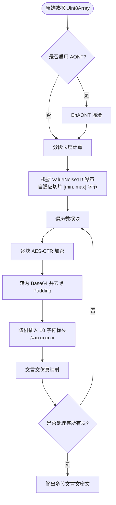
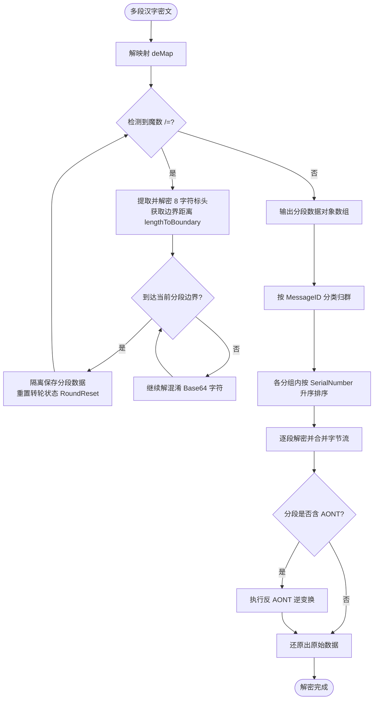

# 灵活分段传输

灵活分段传输 是魔曰针对超长文本或二进制文件传输设计的核心扩展机制。

## 实用功能与应用场景

在实际使用中，灵活分段传输能提供以下关键的实用体验：

- **多渠道分发传输**：由于数据被拆分为数个独立的密文段，你可以将它们通过不同的社交平台、论坛贴文或聊天窗口分别发出，最后由接收方一并收集并解密。
- **乱序接收与自动重组**：每个分段密文中均嵌有隐藏的序列号(SerialNumber)和消息标识(MessageID)。接收方可以杂乱无章地导入密文，系统会自动按发送方归类、按顺序重组并恢复明文，对传输顺序和通道没有任何要求。
- **消除字频统计特征**：超长密文如果单条转换并大段发送，容易暴露句式重复率或呈现字频特征。分段传输使用一维值噪声(`ValueNoise1D`)对数据进行动态长度切片，允许用户分开甚至跨平台发送密文，可有效减弱长文本在统计学上的特征关联。
- **全有或全无保护(AONT)**：开启 AONT 后，密文分段深度纠缠。解密时必须集齐 100% 的分段，即便只缺失任意一个分段，也无法还原出明文的任何局部片段，有效防止信息局部泄露。

## 核心实现机制

为了支持分批分发与无序重组，魔曰在底层实现了四项核心机制：

### 一维值噪声切分

程序使用一维值噪声(`ValueNoise1D`)与余弦平滑插值，在设定的上下限区间内平滑、自适应地产生每一段的分段大小。这种长度分布相比纯随机数更具平滑度，使生成的古文段落长短过渡更加自然。

### AONT(全有或全无)变换

在分段加密前，程序采用基于 MGF1-SHA256 的 4 轮 Feistel 结构操作，对明文进行全有或全无变换(AONT)。

此过程使得所有数据字节彼此纠缠，任何一点数据被篡改或者缺失都会在解密时引发雪崩效应，导致整体数据不可读。此过程是密码学安全的。

::: tip 这意味着什么?

开启 AONT 意味着，缺失/修改任意一个或多个段落的密文，都会导致整条消息完全无法解密，即**全有或全无**。接收方必须完整地接收到某条消息的**所有**密文段落，才能解密该条消息，否则完全无法解密。

反之，接收到部分密文，将可以直接解密出对应部分的明文。

:::

下方的论文给出了此设计之密码学安全性的证明，有关具体代码细节请见 `EncryptHelper.js`。

> Luby, Michael; Rackoff, Charles (April 1988), "How to Construct Pseudorandom Permutations from Pseudorandom Functions", SIAM Journal on Computing, 17 (2): 373–386, doi:10.1137/0217022, ISSN 0097-5397.

### 固定 10 字符标头

每个加密后的分段 Base64 数据中，都会被随机插入一个固定长度为 10 字符的标头，格式为 `... /=xxxxxxxx ...`。

- `"/="` 为灵活分段的魔数标识。
- 后续 8 字符(48 bits)承载经主密钥 CTR 局部混淆的元数据：包含用于定位结束位置以重置转轮(`RoundReset`)的 `lengthToBoundary` (9 bits)、局部 `iv` (14 bits)、`messageID` (12 bits)、`SerialNumber` (12 bits) 和 AONT 状态。

### 转轮状态隔离与排序还原

解密时，解映射器通过 `lengthToBoundary` 精确识别出当前分段的边界，在分段交界处重置三重转轮的状态以避免跨段状态污染。随后，按照 MessageID 归类，并在同一消息下基于 SerialNumber 升序排列，合并拼接后执行 DeAONT 与解密。

::: tip 提示

当一次性导入多个属于不同消息(即 `MessageID` 不同)的密文段落进行合并解密时，**所有消息的加密密码必须保持一致**。

由于解密函数在单次运行中仅接受单一密钥参数，若各消息的密码不同，将无法在同一次调用中成功解密。

:::

::: warning 警告

单条消息分段传输的分段数量上限为 4096 段。

同时，两条本应是不同 ID 的消息，有 1/4096 (0.024%) 的概率发生 `MessageID` 碰撞。一旦发生 ID 碰撞，将无法将这两条 ID 相同的消息混在一起进行合并解密。

:::

## 核心配置参数

在调用 `WenyanInput` 加密时，可在配置项中传入 `FlexibleTransfer` 的相关参数：

- **Enable** (Boolean, 默认 `false`)：是否启用灵活分段传输。
- **UseAONT** (Boolean, 默认 `true`)：是否开启全有或全无转换。开启后防篡改/防局部破解能力最强，但会导致加密解密时间稍微延长，以及一定的内存开销。
- **MessageID** (Number, 默认 `-1`)：消息辨识 ID(0~4095)。若设为 -1，系统会随机生成一个，用于在混合接收时自动剥离不同发送方的消息。
- **RandomParagraphing** (Array, 默认 `[20, 80]`)：指定分段的字节数量上下限。范围为 `[10, 380]`，区间越小密文段落越短。

::: tip 提示

此处的自适应分段是**最外层(字节级)**的切片分段，与文言文仿真层中的**自适应分段**是两个独立且不相干的机制。

在开启灵活分段传输时，数据在最外层(字节级)进行切片分段，每段被独立加密成 Base64。此后各加密段被分别送入文言仿真层，并再次遵循文言文的自适应上限规则进行字符段落切分。

:::

## 灵活分段传输流程

### 加密与分段流程

### 解密与重组流程

