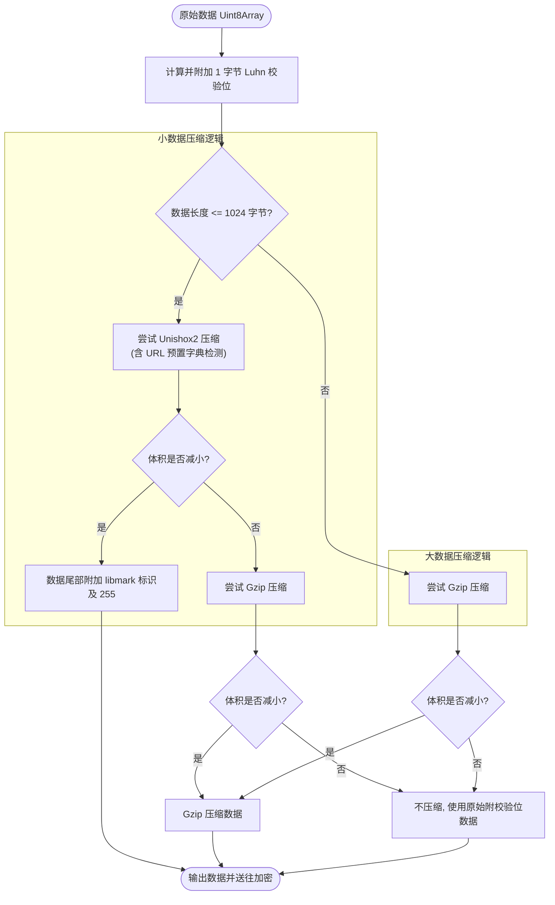
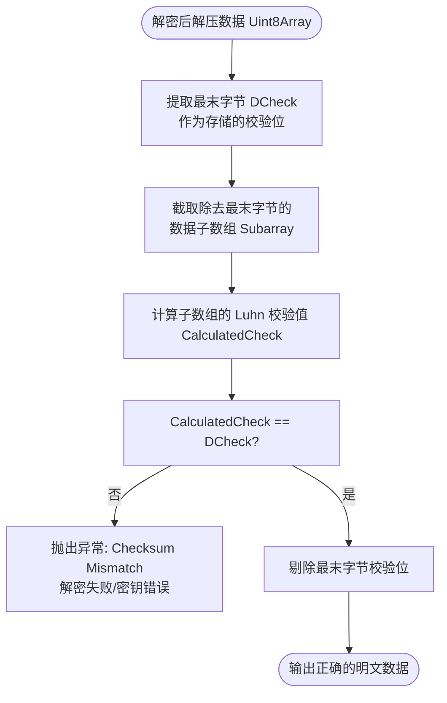

# 压缩和校验管线

为了提高汉字密文的载荷效率并验证解密结果的有效性，魔曰在底层设计了多阶自适应压缩与校验管线。

## 压缩管线

压缩管线在数据被送入 AES 加密前执行。魔曰采用双算法自适应策略，根据输入数据的大小和内容类型自动选择最优算法，以平衡压缩效率与头部开销。

### 自适应压缩

- **Unishox2 压缩(适用于短文本 < 1024 字节)**：
  传统的压缩算法（如 Gzip）含有较重的头部元数据，压缩极短文本时反而会导致体积膨胀。魔曰采用针对短文本优化编码的 **Unishox2** 算法。若 Unishox2 压缩后未能减小体积，程序会回落并尝试 **Gzip** 压缩。
- **Gzip 压缩(适用于大文本 > 1024 字节)**：
  对于超过 1KB 的数据，魔曰直接使用 **Gzip** 执行高压缩比的压缩。若 Gzip 压缩后未能减小体积，则输出原始未压缩数据。

### URL 字典优化

在短文本(Unishox2)模式下，魔曰针对常见的协议头、常用网盘域名、搜索引擎、版本控制站点及种子特征码等编排了 12 套特定的预置字典。
若识别到匹配的特征链接，会使用特定字典压缩，并在压缩数据末尾附加一个标识字节(`libmark`，取值 `243~254`)和 `255` 结束符。这在加密磁力链接（推荐使用十六进制特征码）或云盘链接时，能显著提高压缩比。

| 优化类别     | 标识符 (libmark) | 匹配特征与常用域名                                              |
| :----------- | :--------------: | :-------------------------------------------------------------- |
| 国内网盘     |       254        | `lanzou`, `pan.quark.cn`, `pan.baidu.com`, `aliyundrive.com` 等 |
| 国际网盘     |       245        | `mypikpak.com`, `mega.nz`, `drive.google.com` 等                |
| 国内网站     |       253        | `baidu.com`, `b23.tv`, `bilibili.com`, `weibo.com` 等           |
| 国际网站 (1) |       252        | `google.com`, `youtube.com`, `x.com`, `twitter.com` 等          |
| 国际网站 (2) |       244        | `wikipedia.org`, `github.com`, `pages.dev`, `github.io` 等      |
| 日本网站     |       251        | `pixiv.net`, `nicovideo.jp`, `dlsite.com`, `dmm.com` 等         |
| 资源网站     |       250        | ————                                                            |
| 特殊协议头   |       249        | `magnet:?xt=urn:btih:`, `ed2k://`, `thunder://` 等              |
| 通用后缀 (1) |       248        | `.cn`, `.com`, `.net`, `.org`, `.xyz`                           |
| 通用后缀 (2) |       247        | `.info`, `.moe`, `.cc`, `.co`, `.dev`                           |
| 通用后缀 (3) |       246        | `.io`, `.us`, `.eu`, `.jp`, `.de`                               |
| 通用后缀 (4) |       243        | `.top`, `.one`, `.online`, `.me`, `.ca`                         |

## 校验管线

解密数据后，系统必须判断密钥是否正确以及密文是否完整。魔曰使用轻量级的 [**卢恩算法**](https://zh.wikipedia.org/zh-cn/%E5%8D%A2%E6%81%A9%E7%AE%97%E6%B3%95)(US2950048，ISO/IEC 7812-1) 对数据执行快速校验。

### 卢恩算法

- **极简性**：校验码仅占用 1 个字节，避免了 HMAC-SHA256(32 字节)等安全签名导致密文过长的问题。
- **定位**：主要用于检测传输中的随机字符损坏或解密密码错误(检错率约为 70%)。它属于**非密码学强完整性校验**。如需对抗针对密文的主动篡改与完整性攻击，请在高级加密套件中开启 **HMAC-SHA256**。

### 校验流程

加密时，计算原始数据的 Luhn 校验位，并将其拼接在原始数据的最末尾。
解密时，提取最末字节作为期望校验位，对剩余数据重新计算 Luhn 校验位并进行比对，比对通过后再将该校验字节剔除以恢复原始数据。

