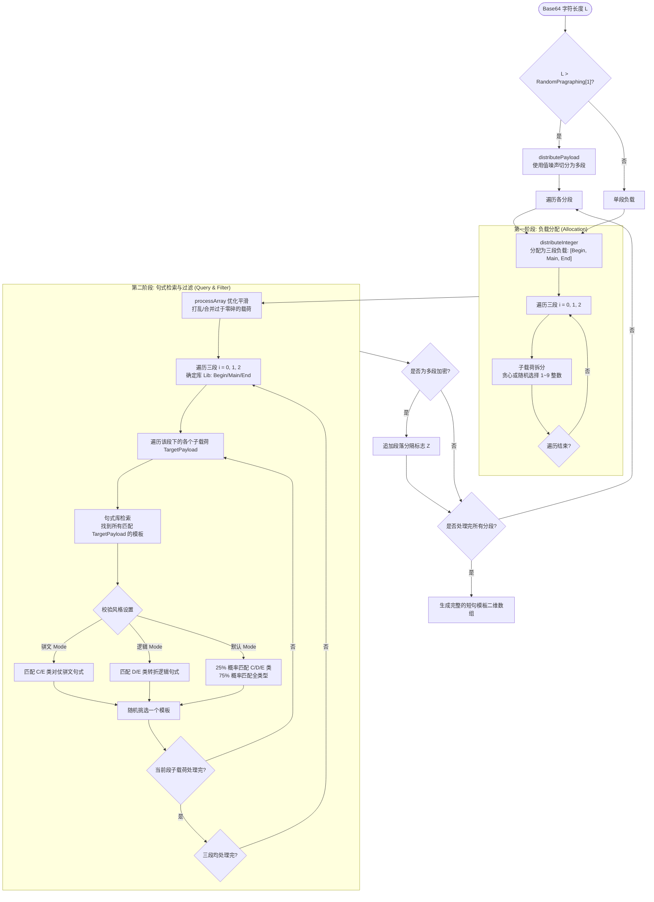
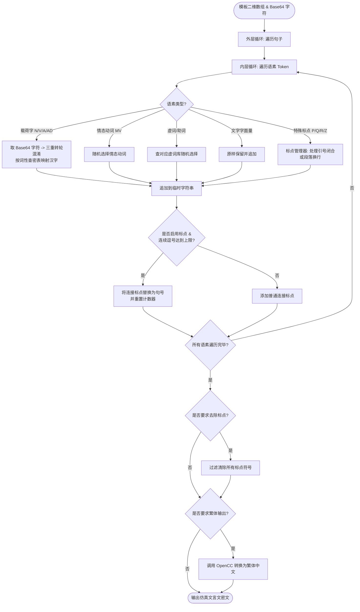

# 文言文仿真管线

::: tip 文言文加密示例
光韵开云，雅于莺茶，停而行之之谓速。是故无悦无谜，无瑞无聪，裳之所走、树之所振也。旧铃之纯水，常为悦水之莹风。人曰：“瑞琴之路，常留于其所允行而不读之处。” 璃非笑而去之者，孰可无鹏。非将选也，非可指也，书非当事涧，仍继叶言，奈何，同森而非航水也，能鸢者益。
:::

文言仿真管线负责将加密并编码混淆后的 Base64 字符串，映射为仿古书面文本中的若干个“载荷字”，并穿插虚词与标点，从而拼装出在句法上看似通顺的伪文言文。

用户可以通过调节随机因子、选择特定文体风格(骈文/逻辑)来干预生成的密文特征。

以下是文言仿真的核心步骤：
1. **分段计算**：对超长密文进行自适应段落分割。
2. **三段式负载分配**：将单段内的总字符数(负载)分配给“初段(Begin)”、“中段(Main)”、“末段(End)”。
3. **句式与词性模板选择**：在对应的句式库中检索符合分配负载的文言句式，并根据文体风格(骈文/逻辑/混合)执行二次过滤。
4. **语素映射与级联混淆**：按模板语法，将 Base64 字符逐个通过三重转轮混淆，并映射为对应词性的汉字，同时随机填充虚词。
5. **标点与段落格式化**：在句间插入合理的标点符号或换行符，并进行标点闭合校验。

## 载荷分配与句式选择

### 自适应分段
如果输入的 Base64 字符长度超过了设定的单段上限(即 `RandomPragraphing[1]`，默认 80)，仿真器会调用 `distributePayload()` 利用一维值噪声自适应地切分成若干个分段，段落之间插入段落标记(`Z`)。

::: tip 提示

此处的自适应分段是 **文言文仿真层** 的字符级分段，与高级加密项下的 **灵活分段传输** 是两个独立且不相干的机制。

在开启灵活分段传输时，数据在最外层(字节级)进行切片分段，每段被独立加密成 Base64。此后各加密段被分别送入文言仿真层，并再次遵循本处的自适应上限规则进行字符段落切分。

:::

### 三段式负载分配
对于单段密文，仿真器会将其总字符数均分为三份，按比例(2:6:2)分别分配给 **Begin(引入段)**、**Main(论述段)**、**End(收尾段)**。每一段都拥有一个独立的句式库，用于保证文章有合理的“起承转合”结构。

### 句式选择与风格过滤
对于每一段的负载量，算法的选择流程分为两个主要阶段：

- **第一阶段：负载拆分与平滑**
  将各段的负载量拆分为若干个 `1 ~ 9` 之间的子负载(因为单个句式能承载的载荷字数量为 1 到 9 个)。拆分时根据用户设定的**随机滑条**概率决定是采用“尽可能选择大载荷的贪心策略”，还是“随机拆分策略”。拆分后，调用 `processArray()` 对子载荷数组进行后处理，打乱并合并过于零碎的载荷，防止生成连续雷同的句法。
- **第二阶段：句式检索与过滤**
  遍历 `Begin`、`Main`、`End` 对应的子载荷列表，在对应的句式库中检索匹配当前载荷数的模板。如果用户指定了“骈文”或“逻辑”过滤器，算法会过滤出对应的文体模板(骈文 C/E，逻辑 D/E)，并在候选集中随机抽取一个句式模板。

## 语素映射与标点组装

在选定句式序列后，程序会将所有选中的句式解析为语素(Token)数组，并使用双层循环进行遍历与替换：

- **载荷字(N/V/A/AD)**：这些位置对应密文的有效载荷。程序每次取出一个 Base64 字符，运行**三重转轮混淆**，根据当前位置的词性(名词、动词、形容词、副词)在对应密表中映射为一个文言汉字。
- **情态动词(MV)与虚词**：这些不是有效载荷，其存在是为了使句子通顺。程序会从对应的文言助词/虚词库中随机抽取汉字填入。
- **标点符号(P/Q/R/Z)**：
  - `P` (句号)、`Q` (问号) 在句子末尾添加对应的标点。
  - `R` (冒号和双引号) 用于生成对话句式(例如 `人曰：“...”`)，程序会管理双引号的开启与闭合，防止出现未闭合的悬空引号或连续冒号。
  - `Z` (换行) 插入段落分隔符 `\n\n`。
- **逗号自动控制**：为了避免生成全是逗号或句号的单调文章，程序在组句循环中会统计连续逗号的个数。如果逗号数达到阀值，会自动强制将当前分包的连接标点替换为句号，并重置计数器。

